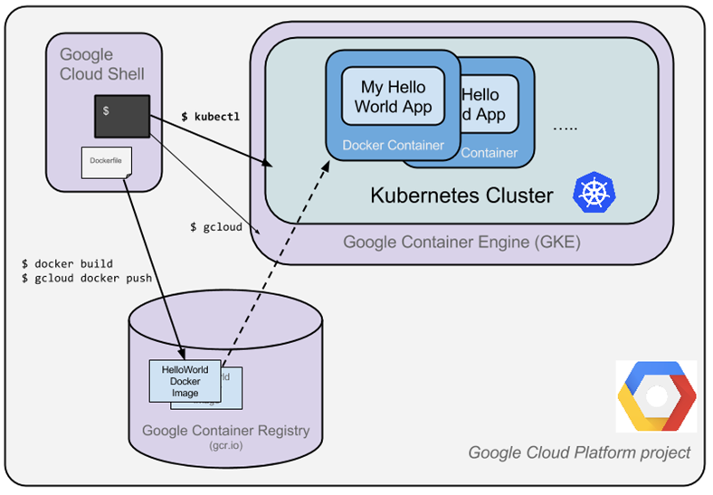
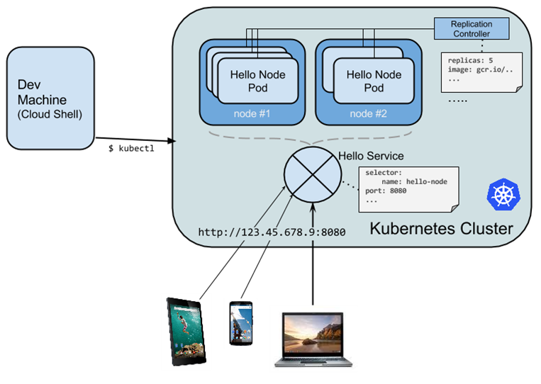

Überblick
The goal of this hands-on lab is for you to turn code that you have developed into a replicated application running on Kubernetes, which is running on Kubernetes Engine.

What you will do
•	Create a Node.js server.
•	Create a Docker container image.
•	Create a container cluster.
•	Create a Kubernetes pod.
•	Scale up your services.

Mit nano die Datei server.js erstellen:

v`ar http = require('http');
var handleRequest = function(request, response) { response.writeHead(200); response.end("Hello World!"); }
var www = http.createServer(handleRequest);
www.listen(8080);`

Since Cloud Shell has the node executable installed, run this command to start the node server (the command produces no output). Use the built-in Web preview feature of Cloud Shell to open a new browser tab and proxy a request to the instance you just started on port 8080.

Before continuing, return to Cloud Shell and type Ctrl+c to stop the running node server.

Mit nano die Datei Dockerfile erstellen:

`FROM node:6.9.2
EXPOSE 8080
COPY server.js .
CMD node server.js`

Build the image:

`docker build -t gcr.io/PROJECT_ID/hello-node:v1 .
`
Ausführen:

`docker run -d -p 8080:8080 gcr.io/PROJECT_ID/hello-node:v1`
Ausprobieren:

`curl http://localhost:8080`

Id bekommen:

`docker ps`

Stop the container:

`docker stop [CONTAINER ID]`

???

`gcloud auth configure-docker`

Push nach gcr:

`docker push gcr.io/PROJECT_ID/hello-node:v1`

Now you have a project-wide Docker image available which Kubernetes can access and orchestrate.

Create the Cluster
project setzen:

`gcloud config set project PROJECT_ID`

Erstelle cluster:

`gcloud container clusters create hello-world \ --num-nodes 2 \ --machine-type n1-standard-1 \ --zone us-central1-a
`

It's time to deploy your own containerized application to the Kubernetes cluster! From now on you'll use the kubectl command line (already set up in your Cloud Shell environment).

Erstelle Pod:

A Kubernetes pod is a group of containers tied together for administration and networking purposes. It can contain single or multiple containers.

`kubectl create deployment hello-node \ --image=gcr.io/PROJECT_ID/hello-node:v1
`

Liste Deployment auf:

`kubectl get deployments`

Liste Pods auf:

`kubectl get pods`

Weitere commands: https://kubernetes.io/docs/reference/kubectl/overview/

`kubectl cluster-info
kubectl config view
kubectl get events
kubectl logs <pod-name>`

You now need to make your pod accessible to the outside world.

By default, the pod is only accessible by its internal IP within the cluster. In order to make the hello-node container accessible from outside the Kubernetes virtual network, you have to expose the pod as a Kubernetes service.

From Cloud Shell you can expose the pod to the public internet with the kubectl expose command combined with the --type="LoadBalancer" flag. This flag is required for the creation of an externally accessible IP:

`kubectl expose deployment hello-node --type="LoadBalancer" --port=8080`

Liste Services auf und bekomme externe IP:

`kubectl get services`

Scale up your service:

`kubectl scale deployment hello-node --replicas=4`

Kontrollieren:

`kubectl get deployment`

Roll out an update to your service:

Modify das server.js File, baue das image und pushe es ins gcr
Note: Building and pushing this updated image should be quicker since caching is being taken advantage of.

Kubernetes will smoothly update your replication controller to the new version of the application. In order to change the image label for your running container, you will edit the existing hello-node deployment and change the image from gcr.io/PROJECT_ID/hello-node:v1 to gcr.io/PROJECT_ID/hello-node:v2.

To do this, use the kubectl edit command. It opens a text editor displaying the full deployment yaml configuration. It isn't necessary to understand the full yaml config right now, just understand that by updating the spec.template.spec.containers.image field in the config you are telling the deployment to update the pods with the new image.

`kubectl edit deployment hello-node`

Look for Spec > containers > image and change the version number to v2:

Run the following to update the deployment with the new image:

`kubectl get deployments`

New pods will be created with the new image and the old pods will be deleted.

Features of the Kubernetes Engine:
•	Identity and Access Management
•	Stateful Application Support
•	Integrated Logging and Monitoring

